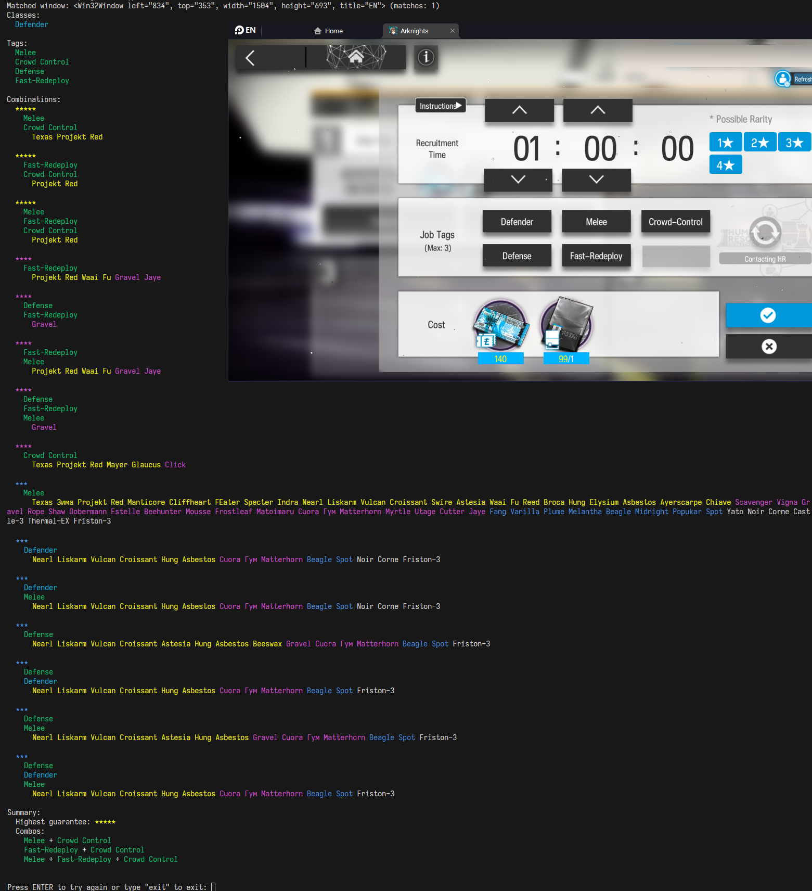
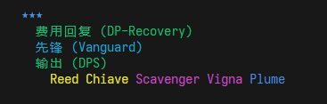

# ak-recruiter

An operator recruitment tool with OCR functionality for Arknights/明日方舟/アークナイツ.

This tool uses data provided by [Aceship](https://github.com/Aceship/AN-EN-Tags) and OCR functionality by [EasyOCR](https://github.com/JaidedAI/EasyOCR) to read Arknights Operator Recruitment data directly from your emulator of choice, and suggest valuable tag combinations for Doctor's convenience.

The tool does not send input events of any sort, and is currently provided only as a command line tool.

## Example output


## Requirements
- Windows 10 or higher
- Python 3.11 or higher

## Installation

Use of [Poetry](https://python-poetry.org/) is recommended. After cloning the repository, install the project:

```sh
poetry install
```

After the virtual environment is installed, spawn a shell in it:

```sh
poetry shell
```

Then you can run the module directly:
```
python -m akrecruiter
```

## Options

While running the tool will prompt the user for the window title name, it's also possible to use the following command line options:

- `--lang <language-code>`

  Uses a specified language code for the OCR functionality. Language codes available:
  - `en` - English (default)
  - `cn` - Simplified Chinese
  - `jp` - Japanese
  - `kr` - Korean

  When using a non-English language code, English translations for the detected tags will appear.

  

- `--window <window-title>` 

  Uses the specified window title to read content from. If not provided, it will be prompted for during the runtime.

- `--verbose`

  Prints out extra information for debugging. Mostly used for troubleshooting OCR issues.

- `--help` Displays available commands

## Notes

- The tool is only able to properly read contents from your main display. If you place your emulator window on a display other than your main one, the OCR will likely fail.
- Make sure the Job Tags (职业需求) remain visible during the reading.
- The OCR process can be sped up if CUDA support is present, otherwise the CPU is used for image processing. Refer to [EasyOCR](https://github.com/JaidedAI/EasyOCR) for more details.
- In some emulator window resolution and language cases, certain characters can be misinterpreted. If the tag list is not being read correctly, try increasing the resolution of the emulator window.